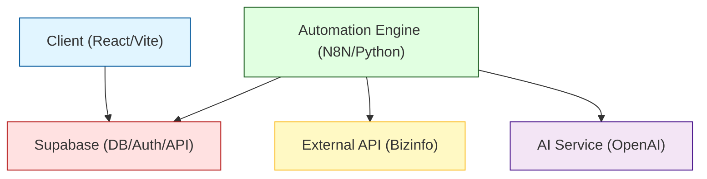
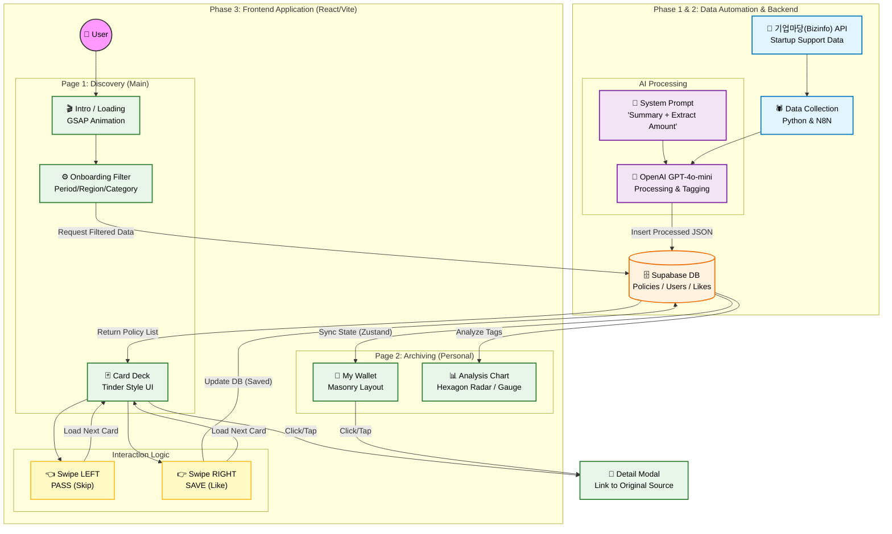

# Policy Matcher (Team Binggle)

> **"모든 것은 돌고 돌아 텍스트에서 시작한다"** > (Everything circulates and starts from text)

**Policy Matcher**는 2030 청년 및 초기 창업자를 위해 복잡한 정책 지원사업 공고를 AI로 3줄 요약하고, 틴더(Tinder) 방식의 직관적인 UI로 추천해 주는 인터랙티브 웹 서비스입니다.

---

## 📚 Table of Contents
- [Project Overview](#-project-overview)
- [System Architecture](#-system-architecture)
- [Service Workflow](#-service-workflow)
- [Database Schema](#-database-schema)
- [Tech Stack](#-tech-stack)
- [Environment Variables](#-environment-variables)

---

## 🔭 Project Overview

- **Target:** 정책 정보를 찾기 어려워하는 2030 청년 및 예비/초기 창업자
- **Key Feature:**
  - **Swipe to Save:** 틴더 스타일의 UI로 쉽고 빠른 공고 탐색 (Left: Pass / Right: Save)
  - **AI Summary:** 난해한 공고문을 GPT-4o가 "핵심 요약 + 지원 금액" 위주로 정제
  - **Archive & Analyze:** 저장한 정책을 기반으로 사용자 취향/유형 분석 (육각형 차트)

---

## 🏗️ System Architecture

전체 시스템은 클라이언트(React), 데이터 자동화 엔진(N8N/Python), 그리고 BaaS(Supabase)로 구성됩니다.



## 🔄 Service Workflow


## 💾 Database Schema
```mermaide
erDiagram
    USERS ||--o{ USER_POLICIES : "saves (likes)"
    POLICIES ||--o{ USER_POLICIES : "is_saved_by"
    
    USERS {
        uuid id PK "Device ID or Auth ID"
        string region "Filter: Region"
        int startup_period "Filter: Years"
        json interests "Filter: Tags"
        timestamp created_at
    }
    
    POLICIES {
        string id PK "Original Policy ID"
        string title
        text summary_3_lines "AI Generated"
        bigint support_amount "Extracted Number"
        string category "Fund/Edu/Space etc."
        string original_link
        string image_url "Category Placeholder"
        date end_date
        json tags
    }

    USER_POLICIES {
        int id PK
        uuid user_id FK
        string policy_id FK
        boolean is_liked "True if Swiped Right"
        timestamp created_at
    }
```

##🛠️ Tech Stack
### Frontend
### Backend & Data
### AI & Tools

## 🔐 Environment Variables
- 프로젝트 실행을 위해 루트 디렉토리에 .env 파일 설정이 필요합니다.

### Frontend (.env)
```
# Supabase Configuration
VITE_SUPABASE_URL=your_supabase_project_url
VITE_SUPABASE_ANON_KEY=your_supabase_anon_key
```

### Backend / Automation (.env)
```
# External API Keys
BIZINFO_API_KEY=your_bizinfo_api_key
OPENAI_API_KEY=your_openai_api_key

# Database Secrets
SUPABASE_SERVICE_ROLE_KEY=your_supabase_service_role_key
DB_CONNECTION_STRING=postgresql://postgres:[PASSWORD]@[HOST]:[PORT]/postgres
```

© 2025 Team Binggle. All Rights Reserved.
